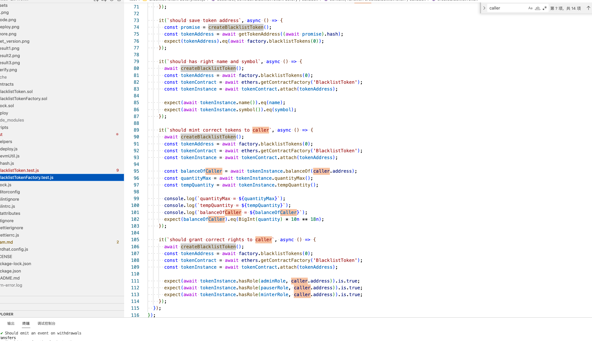

# 区块链培训作业

请大家 fork 本仓库后答题，做完后提交自己的软件仓库链接。

## 第 1 题：Solidity 语言有哪些数据类型？

值类型：
  bool： true/false
  uint8 uint16 unint32 ... uint256 (以8的倍数表示)
  int8 int16 ... int256 (以8的倍数表示)
  byte1 byte2 byte3 ... bytes32
  address / payableaddress 
  enum hex
  fixed(fixed128x18),ufixed(ufixed128x18)
  
引用类型： 
  bytes、[]、String（字符数组）字符串 、mapping、struct 

 
评分标准：每个数据类型计 1 分  
参考资料： https://docs.soliditylang.org/en/latest/types.html

## 第 2 题：列举并测试以太坊的 JSONRPC API。

评分标准：每条有效的（提供文本命令和测试截图） API 计 2 分，例如：

第 1 个 API： net_listening

curl -s -X POST -H "Content-Type: application/json" https://matic-mumbai.chainstacklabs.com \
-d '{"id":10,"jsonrpc":"2.0","method":"net_listening","params":[]}'

第 2 个 API： net_version

curl -s -X POST -H "Content-Type: application/json" https://matic-mumbai.chainstacklabs.com \
-d '{"id":10,"jsonrpc":"2.0","method":"net_version","params":[]}'

第 3 个 API： net_peerCount

curl -s -X POST -H "Content-Type: application/json" https://matic-mumbai.chainstacklabs.com \
-d '{"id":10,"jsonrpc":"2.0","method":"net_peerCount","params":[]}'

第 4 个 API： eth_syncing

curl -s -X POST -H "Content-Type: application/json" https://matic-mumbai.chainstacklabs.com \
-d '{"id":10,"jsonrpc":"2.0","method":"eth_syncing","params":[]}'

第 5 个 API： eth_mining

curl -s -X POST -H "Content-Type: application/json" https://matic-mumbai.chainstacklabs.com \
-d '{"id":10,"jsonrpc":"2.0","method":"eth_mining","params":[]}'

第 6 个 API： eth_gasPrice

curl -s -X POST -H "Content-Type: application/json" https://matic-mumbai.chainstacklabs.com \
-d '{"id":10,"jsonrpc":"2.0","method":"eth_gasPrice","params":[]}'

第 7 个 API： eth_accounts

curl -s -X POST -H "Content-Type: application/json" https://matic-mumbai.chainstacklabs.com \
-d '{"id":10,"jsonrpc":"2.0","method":"eth_accounts","params":[]}'

第 8 个 API： web3_sha3

curl -s -X POST -H "Content-Type: application/json" https://matic-mumbai.chainstacklabs.com \
-d '{"id":10,"jsonrpc":"2.0","method":"web3_sha3","params":["0x825D8152E7D075272896C167f70779c326F18280"]}'

第 9 个 API： web3_clientVersion

curl -s -X POST -H "Content-Type: application/json" https://matic-mumbai.chainstacklabs.com \
-d '{"id":10,"jsonrpc":"2.0","method":"web3_clientVersion","params":[]}'

第 10 个 API： eth_gasPrice

curl -s -X POST -H "Content-Type: application/json" https://matic-mumbai.chainstacklabs.com \
-d '{"id":10,"jsonrpc":"2.0","method":"eth_gasPrice","params":[]}'

第 11 个 API： eth_gasPrice

curl -s -X POST -H "Content-Type: application/json" https://matic-mumbai.chainstacklabs.com \
-d '{"id":10,"jsonrpc":"2.0","method":"eth_getBalance","params":["0x825D8152E7D075272896C167f70779c326F18280","latest"]}'

## 第 3 题：同一个合约里代码相同的函数，为什么 GAS 费不同？

请用 Remix 验证在同一个合约里，名称不同、代码相同的函数的 GAS 费不相等，并解释原因。

解释： 因为 data size 的大小是决定gas费的原因之一，不同的函数名字占用字节大小不一样

评分标准：

-   验证成功： 10 分，对过程要截图
-   解释正确： 10 分

## 第 4 题：用 Remix 部署校验合约

用 Remix 写一个合约，部署到 mumbai 链上，计算 mumbai 链的最近平均出块时间，并校验合约代码代码。

合约地址： 0x6d758e95ed84bbb953e71955a3d8ac6b1fade0e7

评分标准：

-   代码正确：截图 10 分
-   部署成功：截图 10 分
-   代码校验：截图 5 分
-   获取结果：截图 5 分

## 第 5 题：黑名单 ERC20 合约

### 5.1 修复 BlacklistTokenFactory 合约里的 bug

因为本代码仓库里的 BlacklistTokenFactory 合约里有 bug，导致有些测试用例失败，请修复 contracts/BlacklistTokenFactory.sol，通过全部测试。

评分标准：

-   找到 Bug：截图 10 分
-   解释原因：10 分
-   修改合约代码：截图 20 分
-   通过全部测试用例：截图 10 分

### 5.2 优化 BlacklistTokenFactory.test.js

参考： https://hardhat.org/tutorial/testing-contracts , 使用 loadFixture 重构 test/BlacklistTokenFactory.test.js 文件。

评分标准： 30 分

### 5.3 增强 BlacklistToken 合约的功能

修改本代码仓库里的 BlacklistToken 合约代码，在转账的时候抽取 10% 的手续费，并把被扣除的手续费转给合约的创建者。

评分标准：

-   代码正确： 30 分
-   自动化测试：每个有效的（能执行通过）测试用例 10 分，性质相同的用例不重复计分，和转账功能无关的用例不计分
-   部署成功：10 分
-   代码校验：10 分
